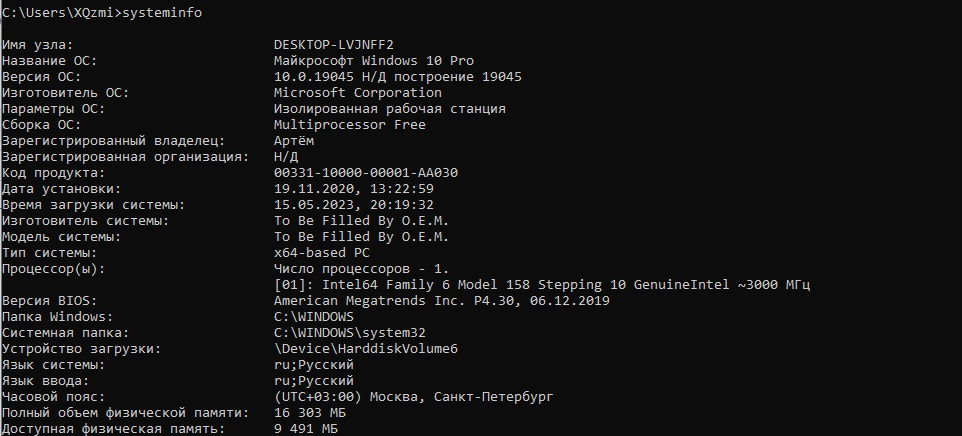
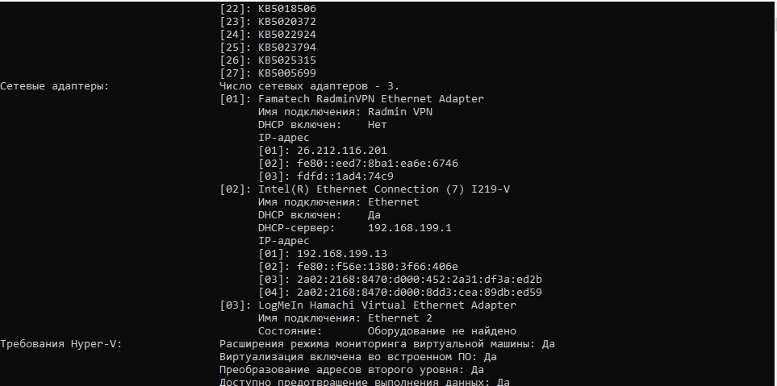

# Сбор информации о системе
Tsvetkov Artyom BISO-03-20

## Цель работы

Получить сведения об используемой системе

## Исходные данные

1.  OC Windows 10

## План работы

1.  Ввод команд в командную строку
2.  Анализ данных

## Ход работы

1.  Получим информацию об используемой системе вводом команды
    systeminfo:

## Оценка результата

В результате лабораторной работы была получена базовая информация он
используемой системе

## Вывод

Таким образом мы научились, используя команды Windows, получать сведения
о системе
